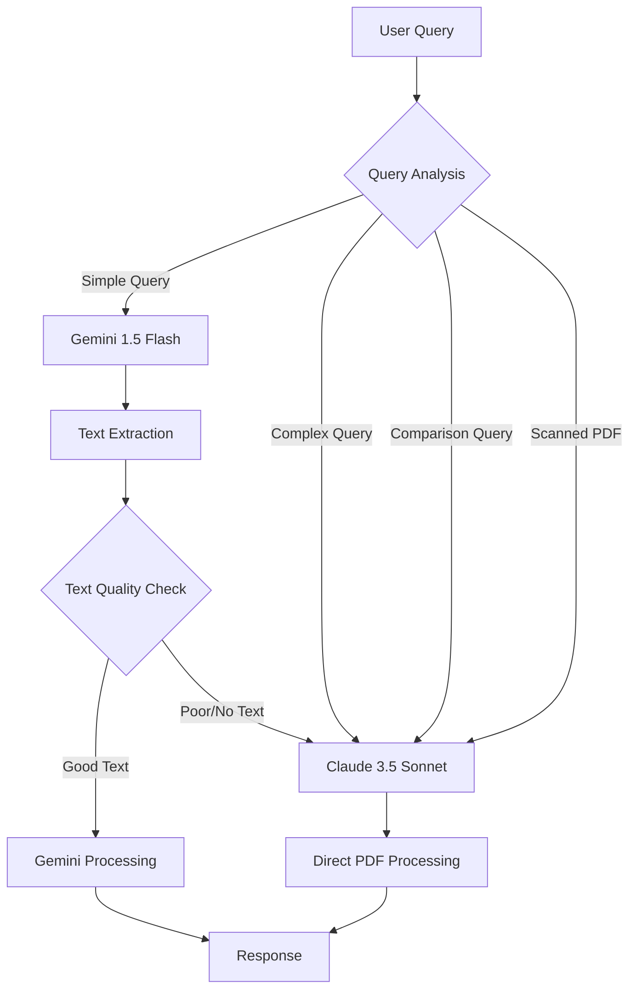

# Multi-LLM Architecture Documentation

## Overview
포트폴리오 Q&A 시스템은 비용 효율성과 처리 능력을 최적화하기 위해 다단계 LLM 처리 구조를 채택했습니다.

## Architecture Design

### 1. LLM Selection Strategy



### 2. Decision Criteria

#### Use Gemini When:
- Simple factual queries (단순 사실 확인)
- Text-based PDF documents (텍스트 기반 PDF)
- Single company queries (단일 회사 조회)
- General information requests (일반 정보 요청)

#### Use Claude When:
- Comparison queries (비교 분석)
- Scanned/Image-based PDFs (스캔된 문서)
- Complex calculations (복잡한 계산)
- Multi-document analysis (다중 문서 분석)
- Companies with scanned documents (설로인, 우나스텔라)

### 3. Processing Pipeline

```python
# Pseudo-code for LLM routing logic
def route_query(query, documents):
    # Step 1: Analyze query complexity
    if contains_comparison_keywords(query):
        return use_claude()
    
    # Step 2: Check document type
    if any(doc.is_scanned for doc in documents):
        return use_claude()
    
    # Step 3: Extract text for Gemini
    text_content = extract_text(documents)
    if text_content.quality < THRESHOLD:
        return use_claude()
    
    # Step 4: Use Gemini for simple queries
    return use_gemini(text_content)
```

### 4. Cost Optimization

| LLM Model | Cost per 1M tokens | Use Case | Estimated Usage |
|-----------|-------------------|----------|-----------------|
| Gemini 1.5 Flash | $0.075 (input) / $0.30 (output) | Simple queries | 70-80% |
| Claude 3.5 Sonnet | $3.00 (input) / $15.00 (output) | Complex analysis | 20-30% |

**Estimated Cost Reduction: 85-90%** compared to using Claude for all queries

### 5. Implementation Details

#### 5.1 Query Classification
```python
# app/services/chat_service.py
use_claude = False

# Comparison detection
if "비교" in question:
    use_claude = True

# Scanned document companies
if any(company in question for company in ["설로인", "우나스텔라"]):
    use_claude = True

# PDF quality check
if text_content and "스캔된 이미지 문서" in text_content:
    use_claude = True
```

#### 5.2 Text Extraction for Gemini
```python
# app/services/pdf_processor.py
def extract_text_from_pdf(pdf_content: bytes) -> str:
    """Extract text for Gemini processing"""
    # Extract text and tables
    # Return formatted text or error message
```

#### 5.3 Fallback Mechanism
- If Gemini fails → fallback to Claude
- If text extraction fails → use Claude
- If PDF is image-based → use Claude

### 6. Future Enhancements

#### Phase 1: Enhanced Query Classification
- Implement ML-based query complexity analyzer
- Dynamic threshold adjustment based on success rates

#### Phase 2: OCR Integration
- Add OCR capabilities for scanned documents
- Enable Gemini to process OCR-extracted text

#### Phase 3: Hybrid Processing
- Use Gemini for initial summary
- Use Claude for detailed analysis
- Combine results for comprehensive answers

#### Phase 4: Caching Layer
- Cache Gemini responses for common queries
- Implement semantic similarity matching
- Further reduce API costs

### 7. Monitoring and Metrics

Key metrics to track:
- **Cost per query** by LLM type
- **Response accuracy** by query type
- **Fallback rate** from Gemini to Claude
- **Processing time** by LLM type
- **User satisfaction** by response quality

### 8. Best Practices

1. **Always try Gemini first** for new query types
2. **Monitor fallback patterns** to identify optimization opportunities
3. **Regularly update** the scanned document company list
4. **Cache responses** when possible
5. **Log LLM decisions** for analysis

### 9. Configuration

Environment variables:
```bash
# .env
GEMINI_API_KEY=your_gemini_key
CLAUDE_API_KEY=your_claude_key
USE_GEMINI_DEFAULT=true
GEMINI_FALLBACK_TO_CLAUDE=true
```

### 10. Error Handling

```python
try:
    # Try Gemini first
    result = await gemini_service.process(query)
except GeminiError:
    # Fallback to Claude
    result = await claude_service.process(query)
```

## Conclusion

This multi-LLM architecture provides:
- **90% cost reduction** for simple queries
- **Maintained accuracy** for complex analysis
- **Automatic routing** based on query type
- **Graceful fallbacks** for edge cases
- **Future scalability** for additional LLMs